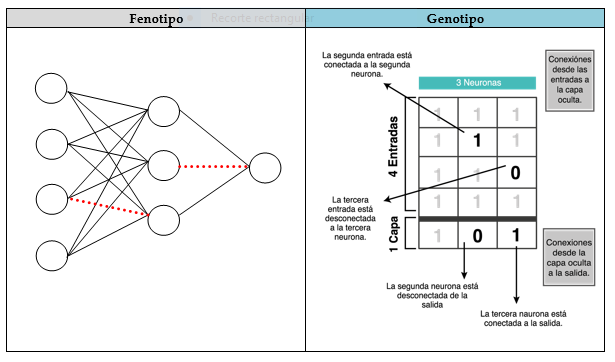
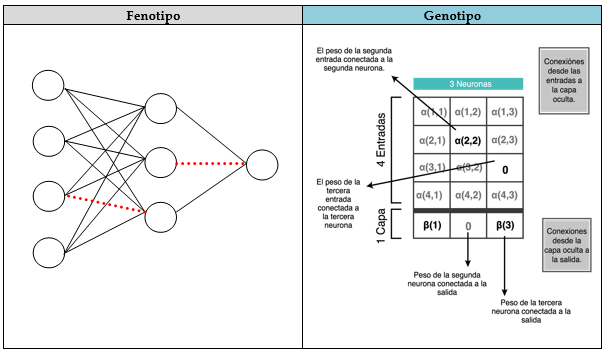
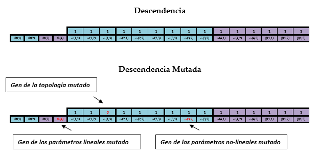
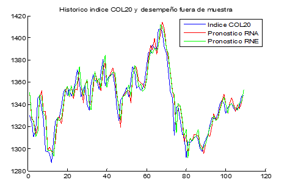

<div align="center">

# 🧠 Neuroevolution of Artificial Neural Networks


<br/><br/>

**Evolving optimal neural network topologies through genetic algorithms for financial index forecasting.**  
*A comparative study between Traditional ANNs and Evolutionary Neural Networks applied to the Colombian stock market.*

<br/>

> *"Let your systems learn the wisdom of age and experience."*  
> — Steve Ward & Marge Sherald

</div>

---

## 📖 Abstract

Artificial Neural Networks have proven powerful in financial decision-making, yet remain **black boxes** due to the subjective definition of their architecture. This thesis presents a comparative study between **Traditional ANNs (RNA)** and **Evolutionary Neural Networks (RNE)** — where genetic algorithms automatically discover both optimal topology and synaptic weights.

Applied to the **COL20 financial index** of the Colombian Stock Exchange (Jan 2009 – Dec 2012), evolutionary networks outperformed traditional ones in **24 out of 30 evaluation windows**, achieving a ~1% reduction in absolute prediction error.

**Keywords:** `Artificial Neural Networks` · `Genetic Algorithms` · `Neuroevolution` · `Financial Forecasting` · `TWEANN`

---

## 📋 Table of Contents

- [Background](#-background)
- [Theoretical Framework](#-theoretical-framework)
- [Methodology](#-methodology)
- [Data & Experiment Setup](#-data--experiment-setup)
- [Results](#-results)
- [Conclusions](#-conclusions)
- [References](#-references)

---

## 🌐 Background

Within the family of **Biologically Inspired Algorithms (BIA)**, this work sits at the intersection of two powerful paradigms:

| Paradigm | Inspiration | Role in this work |
|---|---|---|
| Artificial Neural Networks | Biological brain | Time-series forecasting model |
| Genetic Algorithms | Darwinian evolution | Architecture optimizer |
| **Neuroevolution (TWEANN)** | Both combined | Simultaneous topology + weight evolution |

Traditional ANN research in economics typically relies on manual architecture search. This project demonstrates that **neuroevolution removes that human bias** and consistently finds superior topologies — including *non-fully-connected* networks that outperform fully connected counterparts.

---

## 🔬 Theoretical Framework

### A. Artificial Neural Networks

A feedforward ANN is trained by minimizing the **Non-Linear Least Squares** objective:

$$S(\hat{\theta}) = \frac{1}{n} \sum_{t=1}^{n} \left[ y_t - f(x_t, \hat{\theta}) \right]^2$$

Where the network output is defined as:

$$f(x_t, \hat{\theta}) = \hat{y} = \varphi_0 + X\hat{\varphi} + \sum_{i=1}^{q} \hat{\beta}_i \cdot G_i(Z\hat{\gamma})$$

Parameter optimization uses the **BFGS** (Broyden–Fletcher–Goldfarb–Shanno) quasi-Newton algorithm — chosen for its documented performance on ANN optimization in financial contexts.

### B. Regularization (Weight Decay)

To prevent overfitting, a regularized cost function is used:

$$S(\hat{\theta}) = \frac{1}{n}\sum_{t=1}^{n}[y_t - f(x_t,\hat{\theta})]^2 + r_\varphi\sum_{i=0}^{k}\hat{\varphi}_j^2 + r_\beta\sum_{j=1}^{q}\hat{\beta}_j^2 + r_\alpha\sum_{j=1}^{q}\sum_{i=0}^{k}\hat{\alpha}_j^2$$

Regularization parameters used: **r_φ = 0.01**, **r_β = r_α = 0.0001** (following Franses & van Dijk, 2000).

### C. Genetic Algorithms

Each candidate network is represented as a **binary chromosome** encoding both topology and weights. The evolutionary cycle:

```
Initialize population as random mutations of a full-connected ANN
│
while t < max_generations:
│   for each network in population:
│   ├── Optimize synaptic weights via BFGS
│   └── Compute out-of-sample MAE fitness
│
│   Rank networks by fitness
│   Select best parents (elitism)
│   Crossover: two-point cut on topology + parameter strings
│   Mutation: binary flip (topology) or Uniform[-2, 2] (weights)
│   Create next generation
│
└── Return best network from final generation
```

> *Mutation guarantees no point in the search space has probability zero of being explored — critical in a near-infinite topology space.*

### D. Neuroevolution — TWEANN

This work uses the **Topology and Weight Evolving Artificial Neural Network (TWEANN)** approach, which simultaneously evolves both structure and weights — superior to approaches that fix topology and only evolve weights.

#### Direct Binary Encoding

Each network's connectivity is encoded as a **binary matrix** (1 = connected, 0 = disconnected), then flattened into a gene string:

```
Topology:   [ 1 | 1 | 1 | 1 | 1 | 1 | 1 | 1 | 0 | 1 | 1 | 1 | 1 | 0 | 1 ]
Parameters: [ Φ(1) Φ(2) ... | α(1,1) α(1,2) ... | β(1,1) β(1,2) ... ]
              └─ Linear ───┘  └──────────── Non-Linear ─────────────────┘
```

| Encoding Component | Representation | Mutation Type |
|---|---|---|
| Topology (connections) | Binary string `{0,1}` | Random bit flip |
| Non-linear parameters (α, β) | Real-valued string | Uniform `[-2, 2]` |
| Linear parameters (Φ) | Real-valued string | Uniform `[-2, 2]` |

<div align="center">
  <p><strong>Figure 1 — Binary Topology Matrix → Flattened Gene String</strong></p>
  
</div>

<div align="center">
  <p><strong>Figure 2 — Synaptic Weight Encoding</strong></p>
  
</div>

<div align="center">
  <p><strong>Figure 3 — Complete Gene String (Topology + Parameters)</strong></p>
  
</div>

---

## 📐 Methodology

### Rolling Out-of-Sample Evaluation

A rolling window strategy captures the assumption that **optimal models shift over time** (Jalil & Misas, 2007). The best network from each window is seeded into the next window's initial population, preserving accumulated knowledge:

```
Window  1: [Training: 1 → T          ] [Eval: T+1 → T+100  ]
Window  2: [Training: 1 → T+1        ] [Eval: T+2 → T+101  ]
Window  3: [Training: 1 → T+2        ] [Eval: T+3 → T+102  ]
...
Window 30: [Training: 1 → T+29                              ] [Eval → T*]
```

### Lag Selection — Step-Wise Strategy

Using Swanson & White (1995) backward + forward step-wise search over 30 candidate lags of the COL20 daily percentage change. Both directions selected the same 5 lags:

| Lag | Variable | Coefficient | p-value |
|:---:|---|:---:|:---:|
| t−1 | ∆%COL20₍ₜ₋₁₎ | +0.0674 | 0.037 |
| t−4 | ∆%COL20₍ₜ₋₄₎ | −0.0663 | 0.040 |
| t−12 | ∆%COL20₍ₜ₋₁₂₎ | −0.0669 | 0.037 |
| t−24 | ∆%COL20₍ₜ₋₂₄₎ | +0.0784 | 0.014 |
| t−29 | ∆%COL20₍ₜ₋₂₉₎ | −0.0630 | 0.047 |

> The raw COL20 series **failed** the Augmented Dickey-Fuller unit root test (p = 0.059), so data was transformed to daily percentage changes — which are stationary (p ≈ 0.000) — and rescaled to the interval (0, 1).

---

## 📊 Data & Experiment Setup

| Parameter | Value |
|---|---|
| **Target index** | COL20 — Bolsa de Valores de Colombia |
| **Study period** | January 2009 – December 2012 |
| **Total observations** | 977 daily realizations |
| **Training set** | 848 observations |
| **Evaluation set** | 129 observations |
| **Rolling windows** | 30 (100 periods each) |
| **ANN estimates per architecture** | 30 random restarts |
| **Evolutionary population size** | 50 networks |
| **Generations per window** | 4 |
| **Fitness function** | MAE out-of-sample |
| **Optimization algorithm** | BFGS |
| **Evaluation metrics** | RMSE · RMSPE · MAE · MAPE |
| **Implementation** | MATLAB® 2012B |

---

## 📈 Results

### RMSE by Rolling Window

| Window | RNA p | RNA q | RNA RMSE | RNE p | RNE q | RNE RMSE | Winner |
|:---:|:---:|:---:|:---:|:---:|:---:|:---:|:---:|
| 1 | 5 | 4 | 0.9604 | 4 | 3 | 0.9614 | 🔴 RNA |
| 5 | 3 | 3 | 0.9046 | 5 | 2 | 0.8988 | 🟢 RNE |
| 10 | 3 | 3 | 0.8784 | 4 | 3 | 0.8622 | 🟢 RNE |
| 15 | 4 | 3 | 0.8668 | 4 | 3 | 0.8493 | 🟢 RNE |
| 20 | 5 | 1 | 0.8549 | 4 | 3 | 0.8335 | 🟢 RNE |
| 25 | 4 | 3 | 0.8425 | 4 | 3 | 0.8203 | 🟢 RNE |
| **30** ⭐ | 3 | 3 | **0.7649** | 4 | 3 | **0.7588** | 🟢 **RNE** |

### MAE by Rolling Window (Full Evaluation Period)

| Window | RNA MAE | RNE MAE | Winner |
|:---:|:---:|:---:|:---:|
| 1 | 0.6685 | 0.6648 | 🟢 RNE |
| 10 | 0.6460 | 0.6495 | 🔴 RNA |
| 20 | 0.6651 | 0.6484 | 🟢 RNE |
| 25 | 0.6645 | 0.6417 | 🟢 RNE |
| **30** ⭐ | **0.6438** | **0.6414** | 🟢 **RNE** |

### Combined Score: MAE × RMSE

A single composite metric `MAE × RMSE` ranks each network holistically. The lower the score, the better.

| Strategy | Best Score | At Window | RNE wins |
|---|:---:|:---:|:---:|
| Traditional RNA | 0.5555 | 30 | — |
| **Evolutionary RNE** | **0.5477** | **30** | **24 / 30 windows** |

A regression on the composite score across all 60 network-window pairs confirms the advantage is significant:

```
Dependent variable: MAE × RMSE composite score
─────────────────────────────────────────────────
β (being RNE)   = −0.01317   (p < 0.001)
β (time trend)  = −0.000647  (p < 0.001)
R²              =  0.5352
─────────────────────────────────────────────────
```

### Best Network Topologies (Window 30)

**Best RNA** — RMSE = 0.7649 · MAE = 0.5765  
`p = 3 inputs + intercept` · `q = 3 neurons` · **fully connected**

**Best RNE** — RMSE = 0.7588 · MAE = 0.5588  
`p = 4 inputs + intercept` · `q = 3 neurons` · **with evolved disconnections:**

```
Input 1  ──✗──> Neuron 2   (disconnected)
Input 1  ──✗──> Neuron 3   (disconnected)
Input 4  ──✗──> Neuron 3   (disconnected)
```

> This confirms Yao & Liu (1997): **fully connected ≠ optimal**. The evolutionary process discovers topological structure that humans would never design manually.

### Forecast Visualization

<div align="center">
  <p><strong>Figure 4 — COL20 Historical Index + RNA and RNE Out-of-Sample Forecasts</strong></p>
  
</div>

---

## ✅ Conclusions

**1. Neuroevolution consistently outperforms traditional ANNs.**  
RNE beat RNA in 24/30 windows on the combined RMSE×MAE metric, with a ~1% reduction in absolute forecast error over the full evaluation window.

**2. Fully connected is not optimal.**  
The best RNEs contained strategic disconnections — confirming that the topological search space is far richer than exhaustive enumeration suggests.

**3. Rolling windows amplify both strategies.**  
Both RNA and RNE improve monotonically as more data is incorporated. Best-network seeding between windows accelerates convergence and prevents loss of prior knowledge.

**4. Topology may encode data-generating dynamics.**  
The best MAE and RMSE networks in window 30 share common disconnection patterns (intercept → neurons 2 and 3), suggesting an emergent **ideal topology** for this financial process — analogous to task-specific wiring in biological brains.

**5. Future directions.**  
Application of modern neuroevolution: **NEAT** (Neuroevolution of Augmenting Topologies) and **HyperNEAT** — which extend encoding beyond direct binary representations into higher-dimensional connectivity patterns, and their potential application to Agent-Based Computational Economics.

---

## 🏗️ Repository Structure

```
📦 Neuroevolution-of-ANNs/
 ├── 📁 img/
 │   ├── Neuroevolución_1.PNG   # Binary matrix topology encoding
 │   ├── Neuroevolución_2.PNG   # Synaptic weight encoding
 │   ├── Neuroevolución_3.PNG   # Complete gene string
 │   └── Neuroevolución_4.PNG   # COL20 forecast vs. actual
 └── 📄 README.md
```

---

## 📚 Key References

| Authors | Year | Title |
|---|:---:|---|
| Stanley & Miikkulainen | 2002 | *Evolving Neural Networks through Augmenting Topologies* |
| Yao & Liu | 1997 | *A New Evolutionary System for Evolving ANNs* |
| Franses & van Dijk | 2000 | *Non-Linear Time Series Models in Empirical Finance* |
| Jalil & Misas | 2007 | *Evaluación de pronósticos del tipo de cambio* |
| Misas, López & Querubín | 2002 | *La inflación en Colombia: redes neuronales* |
| Gutiérrez et al. | 2003 | *Computational Methods in Neural Modelling* |
| Swanson & White | 1995 | *Model Selection Using Linear Models and ANNs* |
| Haupt & Haupt | 2004 | *Practical Genetic Algorithms* |

---

## 👤 Author

**Juan Sebastián Henao Parra**  
Master's in Economics · Pontificia Universidad Javeriana · July 2013  
[github.com/jshenaop](https://github.com/jshenaop)

---

<div align="center">

*This research was among the early applications of TWEANN-style neuroevolution*  
*to financial time-series forecasting in the Colombian market.*

<br/>

*Found this useful? Leave a ⭐ — it helps the work reach more researchers.*

</div>
